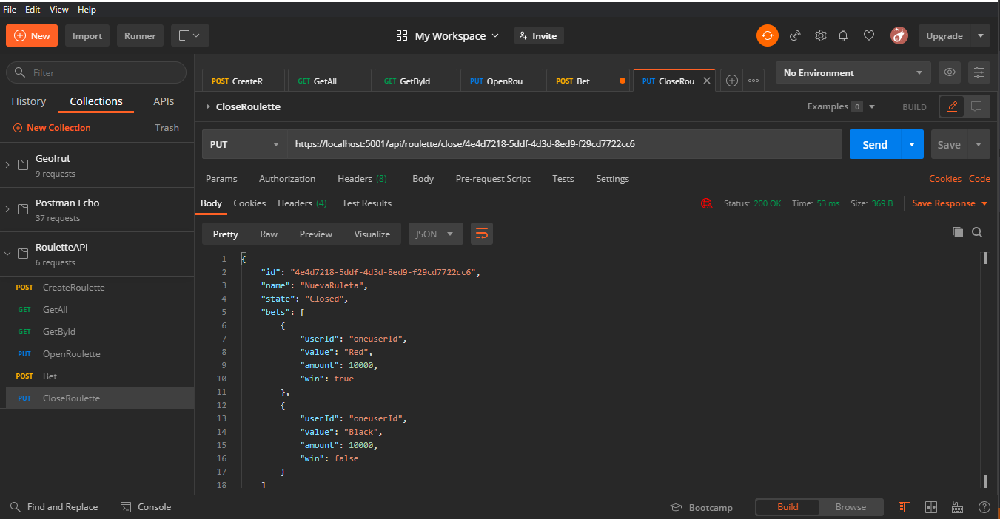

# RuletaRest
Es la primera vez que uso Redis, por lo que algunas partes del código no son tan eficientes como me gustaría.
Para el correcto uso de la API, se debe contar con un contenedor docker con una imagen de redis totalmente limpia en el puerto 6379.
en caso de no estar limpia, descomentar la linea  22 de RouletteController: //this.client.FlushDb();

## Endpoints:
A continuación se listan los endpoints de la aplicación, con sus respectivos métodos. tener en cuenta si el número del puerto cambia al ejecutar la aplicación.

### Create Roulette:
##### POST:  https://localhost:5001/api/roulette
json sample:
{
 "name": "NuevaRuletav2"
}
### Get All Roulettes:
##### GET  https://localhost:5001/api/roulette
### Get Roulette by id:
##### GET  https://localhost:5001/api/roulette/{rouletteId}
### Open Roulette:
##### PUT  https://localhost:5001/api/roulette/open/{rouletteId}
### Bet in a Roulette:
##### POST https://localhost:5001/api/roulette/{rouletteId}/bet
json sample:
{"value":"Red", "amount":10000}
### Close Roulette:
##### PUT https://localhost:5001/api/roulette/close/{rouletteId}

### Capturas:

